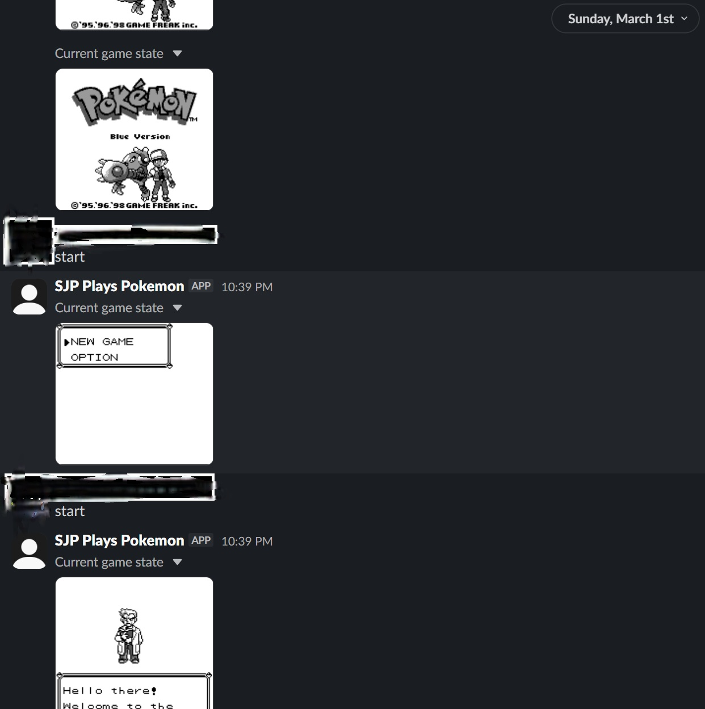

# Slack Plays GBA

A "Twitch Plays Pokemon"-style bot that lets your Slack workspace control a Game Boy emulator.

 Users send button commands in a Slack channel, and the bot feeds them into PyBoy in real time. Screenshots are posted automatically so everyone can follow along.

## How It Works

The bot runs three concurrent threads:

- **Emulator** — [PyBoy](https://github.com/Bonsai/PyBoy) runs the Game Boy ROM headlessly at normal speed (~60 fps). Each tick, the latest frame and audio data are written to shared buffers.
- **Slack bot** — Listens for messages via Socket Mode (no public URL needed). Valid button commands are passed to the active command processor, which either executes them immediately (anarchy) or tallies votes and executes the winner at the end of each time window (democracy). Accepted commands are queued and fed into PyBoy as press/release input events held for a configurable number of frames.
- **Screenshot loop** — On a configurable interval, captures a PNG from the emulator and uploads it to the Slack channel so everyone can follow the game state. Quiet hours suppress overnight posts.

Optionally, a fourth thread pipes raw RGB frames and audio from the emulator buffers to Twitch via ffmpeg.

## Prerequisites

- Python 3.12+
- A Slack app with a bot token and app-level token (Socket Mode enabled)
- A Game Boy / Game Boy Color ROM (`.gb` or `.gbc`)
- ffmpeg (only if using Twitch streaming)

## Setup

**1. Clone the repo and create a virtual environment**

```bash
git clone https://github.com/col726/slack-plays-gba.git
cd slack-plays-gba
python -m venv .venv
source .venv/bin/activate  # Windows: .venv\Scripts\activate
pip install -r requirements.txt
```

**2. Configure environment variables**

```bash
cp .env.example .env
```

Edit `.env` and fill in:

| Variable | Description |
|---|---|
| `SLACK_BOT_TOKEN` | Bot token from your Slack app's OAuth & Permissions page (`xoxb-...`) |
| `SLACK_APP_TOKEN` | App-level token with `connections:write` scope (`xapp-...`) |
| `SLACK_CHANNEL_ID` | ID of the channel to watch (right-click channel → Copy channel ID) |
| `ROM_PATH` | Path to your `.gb` or `.gbc` ROM file |

**3. Set up your Slack app**

In your Slack app settings:
- Enable **Socket Mode**
- Under **OAuth & Permissions**, add the bot scopes: `chat:write`, `files:write`, `channels:history`
- Under **Event Subscriptions**, subscribe to `message.channels`
- Install the app to your workspace and invite the bot to your channel

**4. Run the bot**

```bash
python main.py
```

## Usage

Send button commands in the configured Slack channel:

`up` `down` `left` `right` `a` `b` `start` `select`

**Anarchy mode** (default): every command executes immediately.

**Democracy mode**: votes are collected over a time window and the most-voted command wins. Set `MODE=democracy` and `DEMOCRACY_WINDOW=<seconds>` in `.env`.

Screenshots are posted to the channel automatically on the interval set by `SCREENSHOT_INTERVAL` (default: 300 seconds). Quiet hours can be configured with `QUIET_HOURS_START` and `QUIET_HOURS_END` to suppress overnight screenshots.

## Optional: Twitch Chat Bot

To accept commands from Twitch chat:

**1. Register an application**

Go to [dev.twitch.tv/console](https://dev.twitch.tv/console), create a new application, and set the OAuth redirect URL to `http://localhost`.

**2. Generate a user access token**

Open the following URL in your browser (replace `YOUR_CLIENT_ID`):

```
https://id.twitch.tv/oauth2/authorize?client_id=YOUR_CLIENT_ID&redirect_uri=http://localhost&response_type=token&scope=chat:read+chat:edit
```

Authorize the app. Twitch will redirect to `http://localhost#access_token=xxxxx` — copy the token value from the URL.

**3. Configure `.env`**

```
TWITCH_BOT_TOKEN=xxxxx
TWITCH_CHANNEL=yourchannel
```

## Optional: Twitch Streaming

Set `TWITCH_STREAM_KEY` in `.env` to your Twitch stream key. The bot will pipe the emulator output to Twitch via ffmpeg automatically. Leave it blank to disable.

## License

[MIT](LICENSE)
